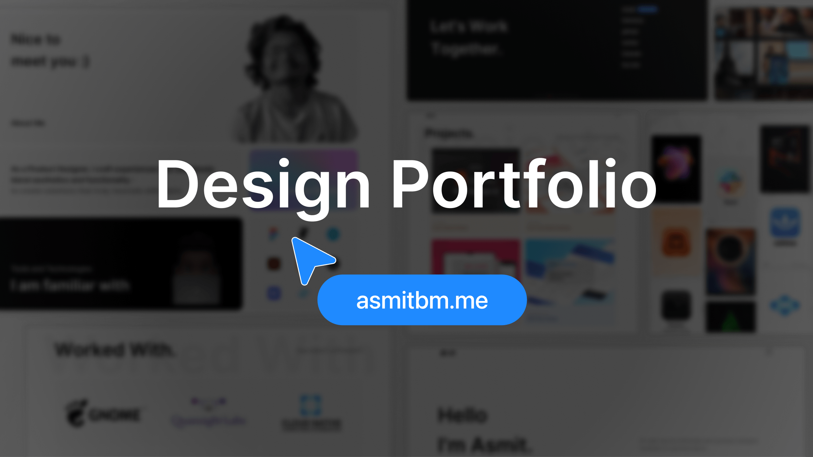

<div align="center">
  
</div>
<h1 align="center">
  <a target="_blank" href="https://asmitbm.me">asmitbm.me</a>
</h1>

<p align="center">
  The second iteration of <a href="https://asmitbm.me" target="_blank">asmitbm.me</a> built with <a href="https://nextjs.org/" target="_blank">Next.js</a> and hosted with <a href="https://vercel.com" target="_blank">Vercel</a>.
</p>

<p align="center">
  Previous iteration(s):
  <a href="https://github.com/asmitbm/asmitbm.github.io" target="_blank">v1</a>
</p>



## Using This Website as Template

If you'd like to use this website design for your own portfolio, you're more than welcome to do so. Just remember to provide proper attribution by including a link back to [asmitbm.me](https://asmitbm.me) :)

## Installation & Set Up

### Online Set Up

Contributing is as easy as starting a new workspace:

[](https://gitpod.io/#https://github.com/asmitbm/portfolio-v2)

### Local Set Up

1. Fork and Clone this repo.

2. Open the cloned folder in your IDE.

3. Install dependencies

    ```sh
    npm install
    ```

4. Start the development server

    ```sh
    npm run dev
    ```

## Building and Running for Production

1. Generate a full static production build

    ```sh
    npm run build
    ```

Feel free to raise issues if you find any bugs in the site. You can also create pull requests to add new features.
